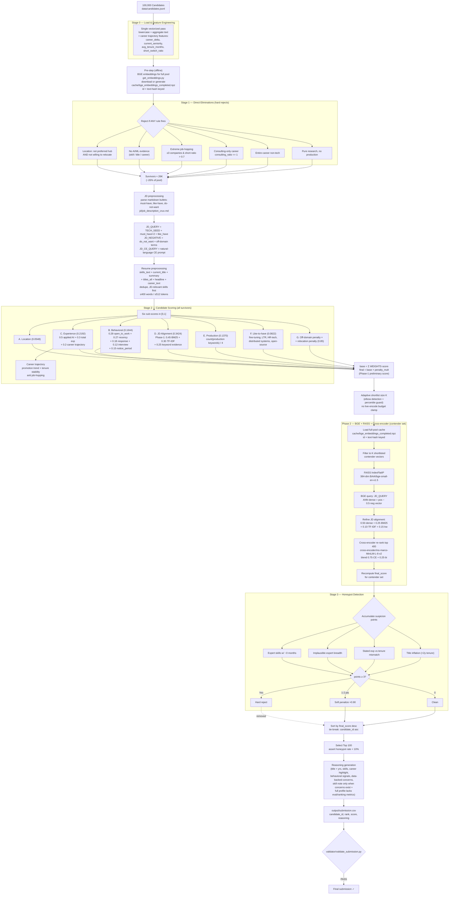

# Candidate Ranking Pipeline — Flowchart

Recruiter-style ranking of the **Top 100** candidates for the *Founding Senior AI Engineer* role.

**Guiding philosophy:** *Eliminate only candidates who are extremely unlikely to be selected per the JD. Everything else is expressed as preferences through scoring.*

Dense BGE embeddings are built **offline once for the entire candidate pool** via `get_embeddings.py` (download from HuggingFace if possible, otherwise generate locally) and persisted to `pipeline/cache/bge_embeddings_completed.npz`. This is the **precomputation step** and must complete before the ranking step starts.

At ranking time `rank.py` only loads the prebuilt full-pool cache and builds a **FAISS index over the shortlisted contenders**, so Phase 2 retrieval covers **all K contenders** while staying inside the 5-minute CPU budget. `rank.py` does **not** download or generate embeddings. Cheap lexical signals still do the heavy filtering first.

This `pipeline/` folder is self-contained: it holds the code, data, cache, job descriptions, validator, and generated output.

---

## High-level flow

---

## Scoring weights (JD-grounded rubric)

`weight ∝ decisiveness × discriminativeness`, normalised to sum to exactly 1.0.

| Component | Decisiveness | Discriminativeness | Weight |
| --- | --- | --- | --- |
| **JD alignment** | 5 | 5 | 0.3424 |
| **Experience** | 4 | 4 | 0.2192 |
| **Behavioral** | 3 | 4 | 0.1644 |
| **Production** | 5 | 2 | 0.1370 |
| **Like-to-have** | 2 | 3 | 0.0822 |
| **Location** | 2 | 2 | 0.0548 |

---

## What is not considered

**Protected / sensitive attributes:** gender, age, date of birth, ethnicity, religion, marital status, disability, salary, expected salary range, candidate photo, anonymized name.

**Unused structured profile fields:** `education` (degree, institution, field of study, grade, tier), `certifications`, `languages`, `current_company_size`, career-history `is_current` / `industry` / `company_size`, skill `endorsements`.

**Unused Redrob signals:** `profile_completeness_score`, `signup_date`, `profile_views_received_30d`, `applications_submitted_30d`, `avg_response_time_hours`, `skill_assessment_scores`, `connection_count`, `endorsements_received`, `expected_salary_range_inr_lpa`, `preferred_work_mode`, `github_activity_score`, `search_appearance_30d`, `saved_by_recruiters_30d`, `offer_acceptance_rate`, `verified_email`, `verified_phone`, `linkedin_connected`.

**Other:** no external API, LLM, or human-in-the-loop is used during ranking; all decisions are deterministic.

---

## Compute constraints

- **≤ 5 min** wall-clock for the ranking step, **CPU only**, **≤ 16 GB RAM**, **no network during ranking**.
- Model download / `pip install` / offline embedding cache build happen in the **pre-step script** (`get_embeddings.py`) allowed outside the 5-min window.
- Dense BGE embeddings are persisted to `cache/bge_embeddings_completed.npz` and indexed with FAISS, so the ranking step loads them instantly.
- Output: exactly **100 rows**, `score` monotonically non-increasing, ties broken by `candidate_id` ascending.
- **Honeypot rate &gt; 10% in the top 100 = disqualification.**
